# Hi there! I'm Diana 👋

  

## 👩‍💻 About Me

I'm a passionate **Data Analyst** and **Data Scientist** originally from **Bogotá, Colombia**, currently based in **Germany**. I have a background in **Industrial Engineering** and several years of experience in the **banking and financial sector**.

I love transforming raw data into actionable insights and building intelligent solutions that solve real-world problems. Whether it's cleaning messy datasets, building machine learning models, or designing dashboards, I enjoy telling meaningful stories with data that drive business impact.

---

## 🛠️ Tech Stack

### 🐍 Programming & Data Manipulation  
- **Python** (Pandas, NumPy, Scikit-learn, Matplotlib, Seaborn)

### 📊 Data Visualization  
- Tableau, Power BI, Plotly

### 🗄️ Databases & Query Languages  
- SQL (PostgreSQL, MySQL)

### 🤖 Machine Learning  
- Supervised & Unsupervised Learning  
- Feature Engineering, Model Evaluation & Tuning

### 📈 Statistics & Experimentation  
- A/B Testing, Hypothesis Testing  
- Regression Analysis, Confidence Intervals

### 🧠 Generative AI & Agents  
- LangChain and OpenAI for building chatbots and smart AI agents

### ☁️ Cloud & DevOps Fundamentals  
- AWS basics (EC2, S3)  
- Docker for containerization  
- Terraform for Infrastructure as Code (IaC)

#### 🔧 Tools & Technologies (Badges)

---

## 📌 Featured Projects

- [**NLP**](https://github.com/Dianaaleja/NLP): Built a conversational AI using LangChain, embeddings, and vector stores  
- [**XGBoost Forecast**](https://github.com/Dianaaleja/corporacion_favorita): Forecasted e-commerce sales using tree-based models  
- [**Client Segmentation**](https://github.com/Dianaaleja/travel_tide_customer_segment): Applied K-means & PCA for travel customer segmentation  
- [**AWS Grocery**](https://github.com/Dianaaleja/AWS_grocery): Deployed a full AWS infrastructure using Terraform (S3, EC2, IAM)

---

## 🏆 Certifications

- ☁️ **AWS Certified Cloud Practitioner**
- 📊 **Cisco Data Analytics Essentials**
- 🧠 **Networking Academy Learn‑A‑Thon 2023**
- 🏫 **Masterschool** – Data Analyst / Data Scientist Path
- 📚 Lifelong learner: webinars, hands-on projects, GitHub collaboration

---

## ✨ Let's Collaborate!

I'm open to collaborating on data science, analytics, or data engineering projects — especially where we can turn messy data into meaningful stories.

💬 Reach me on [**LinkedIn**](https://www.linkedin.com/in/dianaterrazalopez/)  
📧 Or drop me an email: **dianalterlop@gmail.com**

---

  Made with ❤️ by Diana Alejandra Terraza López

